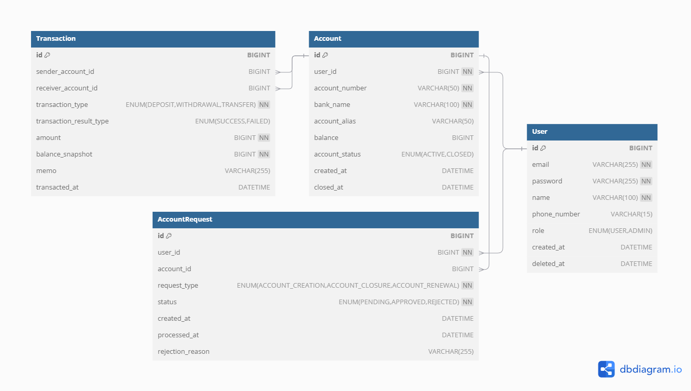

# 🏦 핀테크 프로젝트
사용자들과 금융 정보를 공유하고 거래 내역을 관리할 수 있는 핀테크 플랫폼입니다.

---

# 프로젝트 기능 및 설계

## 회원 관리 기능

### 회원가입
- 사용자는 이메일, 비밀번호, 이름, 휴대폰 번호를 입력하여 회원가입할 수 있습니다.
- 비밀번호는 반드시 해싱 처리되어 저장됩니다.
- 사용자 가입 시 USER 권한이 기본 부여됩니다.
- DB 테이블에서 각 유저는 고유의 id 값을 가집니다.

### 로그인
- 사용자는 이메일과 비밀번호로 로그인할 수 있습니다.
- 로그인 성공 시 JWT 토큰이 발급됩니다.

## 계좌 관리 기능

### 계좌 생성
- 로그인한 사용자는 계좌를 새로 생성할 수 있습니다.

### 계좌 재발급
- 로그인한 사용자는 별도의 사유가 존재하는 이상 이 서버에서 생성한 계좌에 한정하여 계좌를 재발급받을 수 있습니다.
- 계좌 재발급 요청을 보내면 관리자가 이를 확인하고 승인하여야 재발급이 완료됩니다.
- 계좌를 재발급받으면 계좌번호가 변경됩니다.

### 계좌 해지
- 로그인한 사용자는 자신의 계좌 중에서 이 서버에서 생성한 계좌에 한정하여 계좌를 해지할 수 있습니다.
- 계좌 해지 요청을 보내면 관리자가 이를 확인하고 승인하여야 해지가 완료됩니다.
- 잔액이 0원인 계좌만 해지가 가능합니다.

### 계좌 등록
- 로그인한 사용자는 자신의 은행 계좌를 등록할 수 있습니다.
- 계좌 등록 시 은행명, 계좌 번호, 계좌 별칭을 입력합니다.
- 계좌 번호는 중복되지 않아야 합니다.

### 계좌 목록 조회
- 로그인한 사용자는 자신의 계좌 목록을 확인할 수 있습니다.
- 계좌 정보에는 은행명, 계좌 번호(마스킹 처리), 계좌 별칭, 현재 잔액 정보가 포함됩니다.

### 계좌 삭제
- 로그인한 사용자는 자신의 계좌를 목록에서 삭제할 수 있습니다.

## 거래 관리 기능

### 거래 내역 조회
- 로그인한 사용자는 자신의 계좌에서 이루어진 거래 내역을 조회할 수 있습니다.
- 거래 내역에는 거래 금액, 거래 유형(입금/출금), 거래 일시, 거래 상대방 정보가 포함됩니다.
- 거래 내역은 기본적으로 최신순으로 정렬되며, 페이징 처리됩니다.
- 서버에서 발생하는 모든 거래 내역은 거래 과정은 별도의 DB 테이블에 저장됩니다.
- 각 거래 내역은 고유의 id를 배정받고 이를 거래 고유번호로 사용한다.

### 거래 기록 검색
- 사용자는 거래 내역을 거래 유형(입금/출금) 또는 특정 기간 기준으로 검색할 수 있습니다.

### 송금 기능
- 사용자는 등록된 계좌를 통해 다른 계좌로 송금을 진행할 수 있습니다.
- 송금 시 수신 계좌, 송금 금액, 메모를 입력합니다.
- 송금 후 거래 내역이 자동으로 생성됩니다.

## 보안 기능

### 비밀번호 재설정
- 사용자는 비밀번호를 분실했을 경우 사용자 이름과 아이디를 통해 재설정할 수 있습니다.

### 계좌 비밀번호 암호화
- 사용자가 설정한 계좌 비밀번호는 안전하게 암호화됩니다.

---

## ERD

---

## Trouble Shooting
[go to the trouble shooting section](doc/TROUBLE_SHOOTING.md)

---

## Tech Stack

 
     
     
     
     

